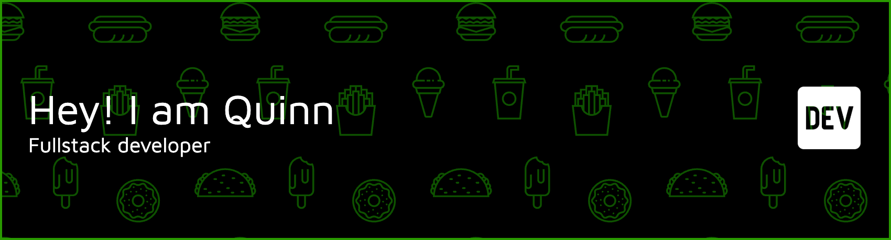

Hi there, I'm Quinn! 👋

I'm a Fullstack Developer with over a year of experience, passionate about building high-performance and scalable web applications. With a strong focus on the JavaScript ecosystem, I specialize in creating modern, responsive user interfaces with Next.js and building robust backend services with Node.js.
I have a proven track record of architecting and developing full-stack systems, from database design and API development to creating intuitive, data-driven user interfaces. I thrive in challenging environments and am always eager to learn and apply new technologies to solve complex problems.
🛠️ My Tech Stack
<table>
<tr>
<td align="center" width="120">

 <strong>TypeScript</strong>
</td>
<td align="center" width="120">

 <strong>Next.js</strong>
</td>
<td align="center" width="120">

 <strong>Node.js</strong>
</td>
<td align="center" width="120">

 <strong>React</strong>
</td>
<td align="center" width="120">

 <strong>Tailwind CSS</strong>
</td>
<td align="center" width="120">

 <strong>PostgreSQL</strong>
</td>
</tr>
<tr>
<td align="center" width="120">

 <strong>MongoDB</strong>
</td>
<td align="center" width="120">

 <strong>Supabase</strong>
</td>
<td align="center" width="120">

 <strong>Docker</strong>
</td>
<td align="center" width="120">

 <strong>Git</strong>
</td>
<td align="center" width="120">

 <strong>NestJS</strong>
</td>
<td align="center" width="120">

 <strong>Redux Toolkit</strong>
</td>
</tr>
</table>
Frontend: React, Redux Toolkit, Zustand, TanStack Query, Shadcn UI, Ant Design, SCSS, Axios
 
Backend: Express.js, PayloadCMS, Drizzle ORM, JWT
 
Databases & BaaS: MySQL, Redis, Firebase (Firestore, Authentication, Storage)
 
Testing: Jest, Vitest, React Testing Library (RTL)
 
Tools & Platforms: Jira, Confluence, Figma, Postman, DBeaver, DigitalOcean
✨ Featured Projects
1. Lumines - AIDA - Enterprise AI Agent Platform
Full Stack Developer
Architected and developed the full-stack system for core platform features, including the management of Agents, Models, and a sophisticated version control system for AI knowledge bases.
Engineered a highly responsive UI using Next.js and TanStack Query for efficient server state management, caching, and optimistic updates.
Designed and implemented end-to-end CRUD functionalities with Supabase (PostgreSQL) as the backend, ensuring data integrity for complex entities.
Key Technologies: Next.js, TypeScript, Supabase, TanStack Query, Shadcn UI, Tailwind CSS, Vitest, Zod.
2. CodeChallenge | Algorithmic Coding Practice Platform
Personal Project - Full Stack Developer
Built a web platform that allows users to solve algorithms, write code in an in-browser IDE, and submit solutions for feedback.
Engineered a secure authentication and authorization system from scratch using NestJS, JWT (with token refresh), and MongoDB.
Implemented real-time features, including a discussion chat and instant notifications, by integrating Socket.IO.
Integrated the Monaco Editor to create an in-browser IDE for a seamless coding experience.
Links:
Frontend: github.com/Quinn28022003/CodeChallenge-FE
Backend: github.com/Quinn28022003/CodeChallenge-BE
Figma Design: View on Figma
3. Lumines - Internal Cloud Management & CRM Platform
Full Stack Developer
Engineered a full-stack internal platform using Next.js to automate VPS provisioning by integrating directly with the DigitalOcean API.
Developed a robust, asynchronous job system for server setup and deployed a secure, authenticated RESTful API for VPS management.
Integrated third-party services like PostHog for user analytics and the Jira API for a built-in customer support ticketing system.
Key Technologies: Next.js, TypeScript, DigitalOcean API, Supabase, Drizzle ORM, PostHog, Jira API.
📫 How to Reach Me
Email: hahoangquan2@gmail.com
LinkedIn: (Your LinkedIn Profile URL Here)
<!-- Add other links like your portfolio website or Twitter if you have them -->
